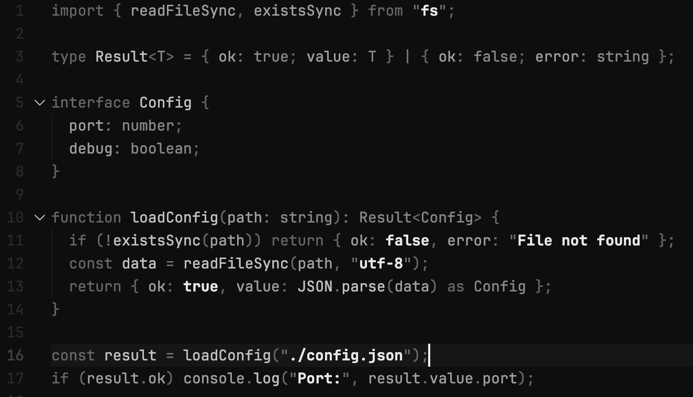
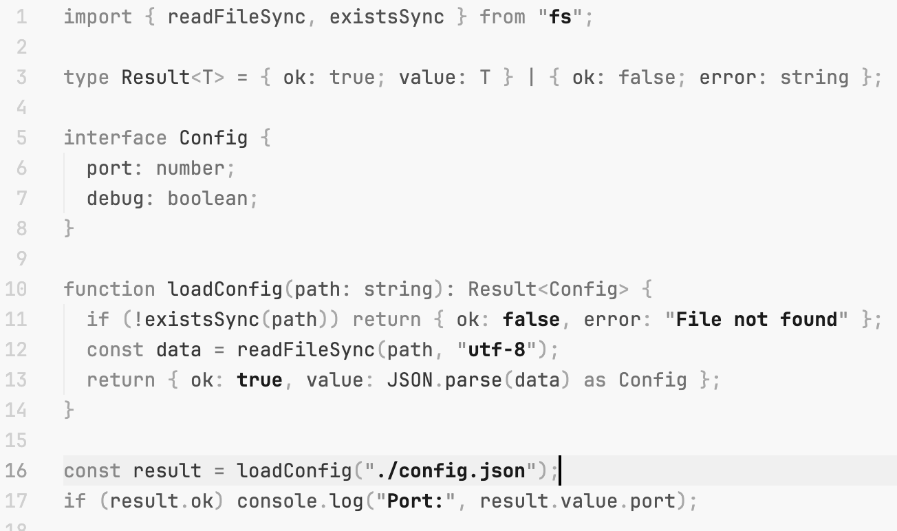

<p align="center">
  
</p>

<h1 align="center">Barecode</h1>

<p align="center">
  A minimal, monochrome VS Code theme designed for focus.<br>
  No syntax rainbow. No distractions. Just code.
</p>

<p align="center">
  <a href="https://marketplace.visualstudio.com/items?itemName=moondef.barecode">
    
  </a>
  <!-- <a href="https://marketplace.visualstudio.com/items?itemName=moondef.barecode">
    
  </a> -->
  <a href="https://github.com/moondef/vscode-barecode-theme/blob/main/LICENSE">
    
  </a>
</p>

---

## Philosophy

Most syntax themes highlight everything. Keywords are blue, strings are green, functions are yellow. Your eyes constantly jump between colors, processing chromatic information that doesn't help you understand the code.

**Barecode inverts this approach:**

- **What YOU wrote** (strings, numbers, names) = prominent
- **What the language requires** (keywords, punctuation) = fades back

The result is a calm, focused editing experience where your attention naturally flows to what matters.

## Screenshots

### Dark Theme



### Light Theme



## Visual Hierarchy

| Element | Dark | Light | Rationale |
|---------|------|-------|-----------|
| **Literals** (strings, numbers) | `#e8e8e8` bold | `#1a1a1a` bold | Your data - maximum prominence |
| **Definitions** (functions, classes) | `#c0c0c0` | `#383838` | Names you create |
| **Identifiers** (variables) | `#a0a0a0` | `#505050` | References to names |
| **Types** | `#888888` | `#707070` | Secondary information |
| **Keywords** | `#686868` | `#888888` | Language scaffolding |
| **Punctuation** | `#686868` | `#a8a8a8` | Structural glue |
| **Comments** | `#d4a050` | `#8a6b2a` | The only color |

## Installation

### From VS Code Marketplace

1. Open **Extensions** sidebar (`Cmd+Shift+X` / `Ctrl+Shift+X`)
2. Search for `Barecode`
3. Click **Install**
4. Open **Command Palette** (`Cmd+Shift+P` / `Ctrl+Shift+P`)
5. Select `Preferences: Color Theme` → `Barecode Dark` or `Barecode Light`

### Manual Installation

```bash
git clone https://github.com/moondef/vscode-barecode-theme.git ~/.vscode/extensions/barecode
```

Restart VS Code and select the theme.

## Recommended Settings

For the best experience, consider these VS Code settings:

```json
{
  "editor.fontFamily": "JetBrains Mono, Fira Code, monospace",
  "editor.fontSize": 14,
  "editor.lineHeight": 1.6,
  "editor.renderWhitespace": "selection",
  "editor.bracketPairColorization.enabled": false,
}
```

## Accessibility

- All text colors meet **WCAG 2.1 AA** contrast requirements (4.5:1 minimum)
- Bold font weight provides additional distinction beyond luminance
- Comments use both color AND italic style for redundant differentiation
- Diff markers use font styles (bold/italic) rather than relying solely on color

## Contributing

Found an issue with a specific language or file type? Please [open an issue](https://github.com/moondef/vscode-barecode-theme/issues) with:

1. The language/file type
2. A code snippet demonstrating the problem
3. What you expected vs. what you see

Pull requests are welcome for language-specific improvements.

## License

[MIT](LICENSE) - Use it however you want.

---

<p align="center">
  <sub>Made for developers who want less noise and more focus.</sub>
</p>
